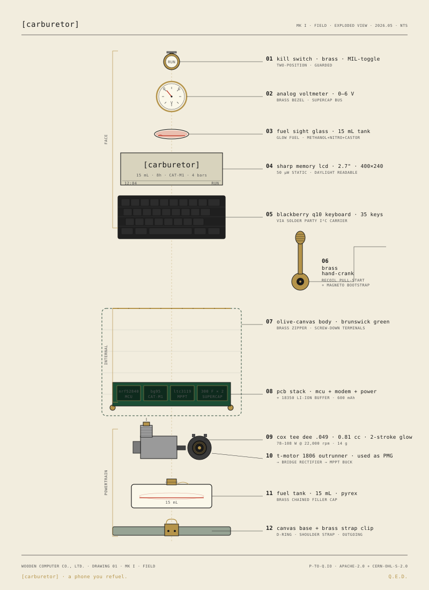

# [carburetor]

**a phone you refuel.**



---

carburetor is a feature phone whose energy source is fuel, not battery. it is a working artifact, not a metaphor. two units. one chassis convention. one telemetry codec.

> prerelease · v0.1 · mk i hardware in bench · mk ii in cad · sim in browser.

## two units

**mk i · field** — the loud one. a cox tee dee .049 micro internal-combustion engine, a brushless outrunner used as a generator, a 300 f supercap bus, an 18350 li-ion buffer, an nrf52840, a sharp memory lcd, a blackberry q10 keyboard, a quectel bg95 modem. in a brunswick-green canvas case with brass terminals and a hand-crank that both starts the engine and bootstraps the mcu before the engine is running.

**mk ii · pilot** — the quiet one. a butane catalytic combustor over a thermoelectric stack, in an anodized-aluminum unibody. a 2.9" e-ink panel. a silicone keymat. the same modem. takes 45 seconds to wake.

mk i is loud. mk ii is silent. both wait. both ask you to wait with them.

## three editions

the project ships at three levels of commitment — all implementing the same five-layer architecture, all emitting byte-identical telemetry:

- **vapore** — the simulator. $0. five minutes. browser only.
- **processta** — the maker edition. ~$120. one weekend. esp32-s3 + cheap nitro + tool-pouch case.
- **classica** — the definitive build. ~$760. multi-weekend. cox tee dee + bg95 + sharp memory lcd + q10 + brass + custom canvas.

see [`docs/editions.md`](docs/editions.md) for the comparison. the three editions exist to validate the architecture's "implementation swap" claim: if you cannot build a $120 version and a $760 version against the same interfaces, the interfaces are not interfaces.

## receipts (not claims)

| what | number | verify |
|---|---|---|
| fuel-to-usb efficiency (mk i) | ⚠️ 5.4 ± 0.3 % | `pnpm bench:fuel-to-wh` against `fixtures/golden/cox-049/manifest.json` |
| warm-up time (mk ii) | ⚠️ 45 ± 5 s | `pnpm bench:warmup` against `fixtures/golden/catalytic-teg/manifest.json` |
| sim state-machine totality | ✅ pending v0.2 | `pnpm sim:test` |
| bom resolvability | ⚠️ pending | `pnpm bom:resolve` |

⚠️ = measured at bench-prototype scale; pinned numbers ship at v0.2.

## you cannot call on it

mk i and mk ii both speak cat-m1 / nb-iot only. data, sms, matrix, ssh — yes. voice — no. removing the voice radio removes the analog front-end, the regulatory burden, half the power budget, and most of the reason a phone has become whatever it has become. what is left is a thing that connects you to your people on schedule, briefly, after a warm-up.

## architecture (five layers)

```
[ fuel ]        chemical potential
   ↓
[ combustor ]   chemical → mechanical / thermal
   ↓
[ bus ]         dc bus · supercap + li-ion buffer · mppt
   ↓
[ compute ]     mcu + display + modem
   ↓
[ ritual ]      sound · heat · light · weight · scent
```

each layer is a typed codec. each codec emits real artifacts: telemetry frames as csv, engine recordings as wav, screen captures as png, oscilloscope traces as svg. see `docs/architecture.md`.

## two surfaces, one architecture

- **typescript (strict)** — the simulator, the site, the telemetry codec, the cli. `packages/`.
- **python** — the engine-thermodynamics prototype, the bom resolver, the adr analyses. `python/sim-mini/`.

both surfaces consume the same telemetry frame format. see `docs/codec-protocol.md`.

## quickstart (30 seconds)

```sh
pnpm install
pnpm sim          # browser at localhost:5173 · pour, crank, watch
pnpm sim:headless # ci mode, writes artifacts/runs/<id>/manifest.json
```

## docs map

- `docs/why.md` — the one-page thesis.
- `docs/architecture.md` — the five layers, with diagrams.
- `docs/codec-protocol.md` — the telemetry frame format.
- `docs/hard-constraints.md` — what will not change.
- `docs/implementation-status.md` — ships / partial / stub matrix.
- `docs/notes/` — design notes, postmortems, sketches.
- `hardware/mk1/` — kicad, freecad, bom.
- `hardware/mk2/` — kicad, freecad, bom.
- `sim/` — `@carburetor/sim` · the playable one.


## how to help

build a unit. file a postmortem. send a photograph of where you put yours. fix a typo. prs welcome — see `CONTRIBUTING.md`.

## License

Apache-2.0. <br/>

Sibling to [`wittgenstein`](https://github.com/p-to-q/wittgenstein)
